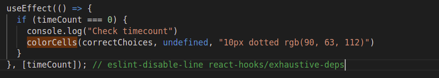

### Error re. missing dependencies

Eslint error in useEffect() about missing dependencies can be corrected by adding a **comment** after the dependencies array:  
`// eslint-disable-line react-hooks/exhaustive-deps`

Example from Memory Crunch game:  

